<div align="center">
  
</div>

<br/>

<div align="center">

[](https://python.org)
[](https://fastapi.tiangolo.com)
[](https://tauri.app)
[](https://react.dev)
[](https://faiss.ai)
[](LICENSE)

**Local-first AI knowledge infrastructure.**  
Ingests documents → encrypts → indexes semantically → understands relationships → retrieves precisely.

[Architecture](#architecture) · [Setup](#setup) · [API](#api-reference) · [Roadmap](#roadmap)

</div>

---

## What is Ragna?

Ragna is **not** a chatbot, a "chat with PDF" wrapper, or a vector database UI.

It is an **AI memory compiler** — infrastructure that transforms raw files into encrypted, semantically indexed, queryable knowledge. Built for developers who need a local-first, privacy-first foundation for AI systems and RAG pipelines.

```
Files → Extract → OCR → Clean → Chunk → Embed → Encrypt → FAISS
                                                              ↓
                                  Entities ← NER ← Decrypt ← Search
                                  Summary  ← LLM ↗
```

---

## Current State — v0.2.0

> **Status: functional MVP with production-grade crypto and retrieval.**

### ✅ Implemented

| Area | What's Working |
|---|---|
| **Ingestion** | PDF, DOCX, XLSX, EPUB, MD, TXT, HTML, CSV, JSON, PNG, JPG, WEBP |
| **OCR** | Tesseract + OpenCV (deskew · denoise · adaptive threshold) |
| **Chunking** | Section-aware · NLTK sentence tokenizer · configurable overlap |
| **Embeddings** | `all-MiniLM-L6-v2` (384-dim) · batch processing · thread-safe singleton |
| **Vector Search** | FAISS `IndexIDMap2` · in-memory cache · selective delete (no rebuild) |
| **Reranking** | Cross-encoder `ms-marco-MiniLM-L-6-v2` · sigmoid scoring · UI toggle included |
| **Encryption** | AES-256-GCM per chunk · Argon2id KDF (64MB · 3 passes) · unique 12-byte nonce |
| **Sessions** | Memory-only tokens · TTL expiry · rate limiting on `/unlock` (slowapi) |
| **NER** | Tier-1: rule-based TECH_VOCAB · Tier-2: NLTK chunker · Tier-3: spaCy (optional) |
| **Summarization** | TF-weighted extractive (offline) · Ollama LLM (local) · configurable per vault |
| **Watch Mode** | OS-native events · **UI Folder Picker included** (Tauri native dialog) |
| **Management** | Create/rename/delete vaults · delete documents · cascade cleanup |
| **Deduplication** | SHA-256 file hash before processing |
| **Language** | Auto-detection via `langdetect` |
| **Desktop** | Tauri 2 (Rust) · React 19 · TypeScript · **Tailwind CSS v4** |
| **Settings** | Threshold slider · reranker toggle · Ollama config · backend URL test |

---

## Architecture

```
┌─────────────────────────────────────────────────────────────────┐
│                         RAGNA STACK                             │
├──────────────────┬──────────────────────────────────────────────┤
│  Desktop UI      │  Tauri 2 (Rust bridge) + React 19 + TS       │
├──────────────────┼──────────────────────────────────────────────┤
│  API Layer       │  FastAPI · Async · BackgroundTasks            │
│  Security        │  slowapi rate-limit · Session TTL             │
├──────────────────┼──────────────────────────────────────────────┤
│  Ingestion       │  Multi-format extraction → OCR → Clean        │
│                  │  → Section chunking → asyncio.to_thread       │
├──────────────────┼──────────────────────────────────────────────┤
│  Intelligence    │  Embeddings (bi-encoder, local)               │
│                  │  ├─ FAISS IndexIDMap2 + IP cosine (fast ANN)  │
│                  │  ├─ Cross-encoder reranker (precision)        │
│                  │  ├─ NER (rule / NLTK / spaCy tier)            │
│                  │  └─ Summarization (extractive / Ollama)       │
├──────────────────┼──────────────────────────────────────────────┤
│  Storage         │  SQLite · per-chunk AES-256-GCM · FAISS .idx  │
│  Watch Mode      │  watchdog → SHA-256 dedup → pipeline queue    │
└──────────────────┴──────────────────────────────────────────────┘
```

### Search Pipeline

```
Query string
    │
    ▼
Bi-encoder embedding (all-MiniLM-L6-v2)
    │
    ▼
FAISS IndexIDMap2 — top_k × 4 candidates  (when reranking ON)
    │
    ▼
Decrypt matching chunks from SQLite
    │
    ├─ [rerank=false]──────────────────────────────────────▶ Cosine threshold → results
    │
    └─ [rerank=true]→ Cross-encoder (ms-marco-MiniLM-L-6-v2)
                           │ sigmoid score [0,1]
                           ▼
                      Threshold filter → sort → top_k results
```

### Encryption Model

```
password + salt (32B random)
    │
    ▼ Argon2id (64MB · 3 passes · 4 threads)
    │
    ▼
32-byte AES key  [memory only — never persisted]
    │
    ├─ Per chunk: nonce(12B) ‖ AES-256-GCM(content) ‖ tag(16B)
    └─ FAISS index: plain (embeddings not secret — no PII in vectors)
```

---

## Setup

### Prerequisites

| Tool | Required | Notes |
|---|---|---|
| Python | 3.11+ | |
| Node.js | 18+ | |
| pnpm | any | `npm i -g pnpm` |
| Rust + Cargo | latest stable | [tauri.app/start/prerequisites](https://tauri.app/start/prerequisites/) |
| Tesseract | optional | OCR for images/scans |
| Ollama | optional | Local LLM summarization |

**Tesseract install:**
```bash
# Ubuntu/Debian
sudo apt install tesseract-ocr

# macOS
brew install tesseract

# Windows
winget install UB-Mannheim.TesseractOCR
```

**Ollama install (optional — for AI summaries):**
```bash
curl -fsSL https://ollama.com/install.sh | sh
ollama pull llama3.2:3b   # lightweight, fast
```

---

### 1. Backend

```bash
cd backend

# Create virtual environment
python -m venv .venv
source .venv/bin/activate        # Windows: .venv\Scripts\activate

# Install dependencies
pip install -r requirements.txt

# Download NLTK data (one-time)
python -c "
import nltk
for pkg in ('punkt', 'punkt_tab', 'maxent_ne_chunker', 'words', 'averaged_perceptron_tagger', 'stopwords'):
    nltk.download(pkg, quiet=True)
print('NLTK ready.')
"

# Start server
# First run: downloads all-MiniLM-L6-v2 (~90MB) and reranker (~80MB)
uvicorn main:app --reload --port 8000
```

API available at: `http://localhost:8000`  
Interactive docs: `http://localhost:8000/docs`

**Optional — spaCy Tier-3 NER (better entity detection):**
```bash
pip install spacy
python -m spacy download en_core_web_sm
```

---

### 2. Frontend (Tauri Desktop)

```bash
cd frontend
pnpm install
pnpm tauri dev
```

**Web-only mode** (no Rust/Tauri required):
```bash
pnpm dev
# → http://localhost:1420
```

---

## Usage

| Step | Action |
|---|---|
| **1. Create vault** | Click "New Vault" → name + encryption password |
| **2. Unlock** | Click vault → enter password (Argon2id derives AES key in-memory) |
| **3. Ingest** | Drop files onto Upload zone — multiple files, all formats |
| **4. Search** | Type a concept, topic, or question — not just keywords |
| **5. Inspect** | Knowledge view → expand doc → see summary + extracted entities |
| **6. Manage** | Settings → rename vault, adjust threshold, configure Ollama |
| **7. Watch** | (API) POST `/vaults/{id}/watchers` → folder auto-sync on file change |

**Search threshold guidance:**
- `65–80%` — strict, high precision, fewer results
- `45–65%` — balanced _(default: 45%)_
- `25–45%` — loose, good for exploration

---

## API Reference

```http
# Vaults
POST   /vaults                       Create vault (name + password)
GET    /vaults                       List all vaults
POST   /vaults/{id}/unlock           Derive key, issue session token
POST   /vaults/{id}/lock             Invalidate token
PATCH  /vaults/{id}                  Rename vault
DELETE /vaults/{id}                  Delete vault + all data + FAISS index

# Documents
GET    /vaults/{id}/documents        List documents (ordered by date desc)
GET    /documents/{id}               Get document + status + summary
DELETE /documents/{id}               Remove document + chunks + FAISS entries

# Ingest
POST   /ingest                       Upload file (async pipeline)
       ?summary_mode=extractive|ollama|disabled
       ?rerank=false|true

# Search
POST   /search                       Semantic search
       { query, top_k, threshold, rerank }

# Entities
GET    /vaults/{id}/entities         All entities for vault (filterable by type)
GET    /documents/{id}/entities      Entities for document

# Watch Mode
GET    /vaults/{id}/watchers         List active folder watchers
POST   /vaults/{id}/watchers         Add folder watcher { path, recursive }
DELETE /watchers/{id}                Remove watcher

# System
GET    /health                       { status, version, reranker_available }
```

### Authentication

Every endpoint (except `/vaults`, `/vaults/{id}/unlock`, `/health`) requires:

```http
X-Session-Token: <token-from-unlock>
```

Tokens live in memory only — never written to disk. TTL: 1 hour (configurable).

---

## Configuration

Key settings in `backend/config.py` / `.env`:

```bash
# Paths
DATA_DIR=./data

# Embeddings
EMBEDDING_MODEL=all-MiniLM-L6-v2
EMBEDDING_DIM=384
EMBEDDING_BATCH_SIZE=32

# Chunking
CHUNK_MAX_TOKENS=400
CHUNK_OVERLAP_SENTENCES=1

# Argon2id (increase for higher security — costs unlock latency)
ARGON2_TIME_COST=3
ARGON2_MEMORY_COST=65536   # 64 MB
ARGON2_PARALLELISM=4

# Session
SESSION_TTL=3600

# Rate limiting (brute-force protection on /unlock)
RATE_LIMIT_UNLOCK=5/minute
```

---

## Roadmap

### Next priorities

| Priority | Feature | Notes |
|---|---|---|
| 🔥 High | **Knowledge Graph** | D3.js visualization of entity relationships (networkx backend) |
| 🟡 Med | **Voice Ingestion** | Whisper (local) transcription for audio/video files |
| 🟡 Med | **Multi-hop RAG** | Query decomposition → multi-chunk synthesis → single answer |
| ⚪ Low | **Agent Memory API** | SSE streaming context endpoint for autonomous agents |
| ⚪ Low | **Federated sync** | Encrypted vault sync via user-owned storage (S3/R2) |
| ⚪ Low | **Collaboration** | Shared vaults (server mode, multi-user, RBAC) |

### Completed ✅

- [x] Multi-vault CRUD (create · rename · delete · cascade)
- [x] AES-256-GCM per-chunk encryption + Argon2id KDF
- [x] Rate limiting (slowapi) on unlock endpoint
- [x] FAISS IndexIDMap2 with selective delete + in-memory cache
- [x] Two-stage retrieval: FAISS bi-encoder → cross-encoder reranker
- [x] Watch Mode UI (Folder picker, watcher list)
- [x] Reranker UI toggle
- [x] 12 document formats (PDF · DOCX · XLSX · EPUB · MD · TXT · HTML · CSV · JSON · PNG · JPG · WEBP)
- [x] OCR pipeline (Tesseract + OpenCV preprocessing)
- [x] 3-tier NER (rule-based · NLTK · spaCy)
- [x] Extractive + Ollama summarization
- [x] Watch Mode backend (OS-native inotify/FSEvents/ReadDirectoryChanges)
- [x] SHA-256 deduplication
- [x] Language auto-detection
- [x] Async background pipeline (non-blocking uploads)
- [x] Settings UI with live threshold slider

---

## Developer

Developed by **Franklin System**  
Portfolio: [franklin-sys.vercel.app](https://franklin-sys.vercel.app/)

---

<div align="center">
<sub>
Local-first · Privacy-first · No telemetry · No cloud dependency<br/>
<code>ENCRYPT · INDEX · UNDERSTAND · RETRIEVE</code>
</sub>
</div>